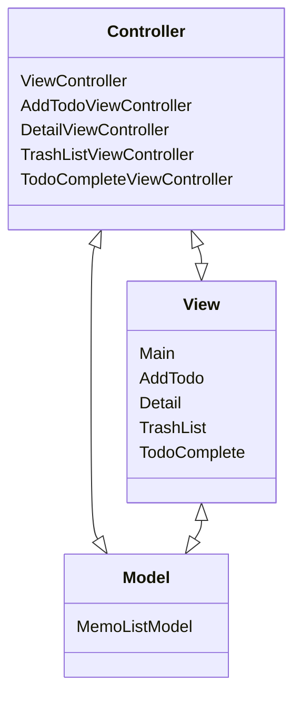

# Todo
Todo App with Swift

```mermaid
  classDiagram
    Controller <|--|> Model
    Controller <|--|> View
View <|--|> Model
    class Controller{
      ViewController
      AddTodoViewController
      DetailViewController
      TrashListViewController
      TodoCompleteViewController
    }
    class Model{
      MemoListModel
    }
    class View{
      Main
      AddTodo
      Detail
      TrashList
      TodoComplete
    }
```
