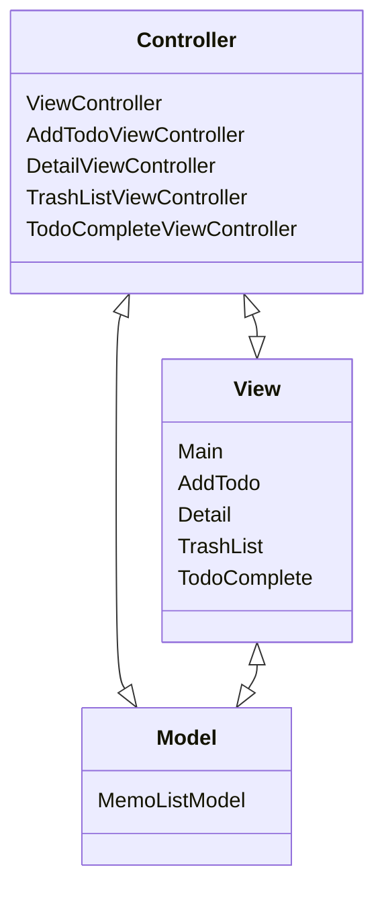

# iOS Arcitecture TODO App
Todo App with Swift



```MemoListModel```은 ```UserDefaultManager```에서 사용하는 Model로 해당 앱에서 사용되는 데이터와 그 데이터를 처리하는 로직을 포함합니다. <br> <br>
```ViewController```는 투두 앱의 ```Main```을 구성하였습니다. ```MemoListModel```을 통해 투두 데이터를 받아, tableview로 메인 화면을 구성하였습니다. Add Button을 통해 AddTodo로의 이동이 가능하고 SideMenu를 통해 ```Detail, TrashList, TodoComplete```로 이동이 가능합니다. 해당 뷰들에 이동하였다가 다시 돌아오면 tableview를 reload하여 실시간으로 데이터가 반영될 수 있도록 하였습니다. 또 Edit 기능을 통해 해당 List가 ```TrashList, TodoComplete```로 이동할 수 있습니다. <br>
